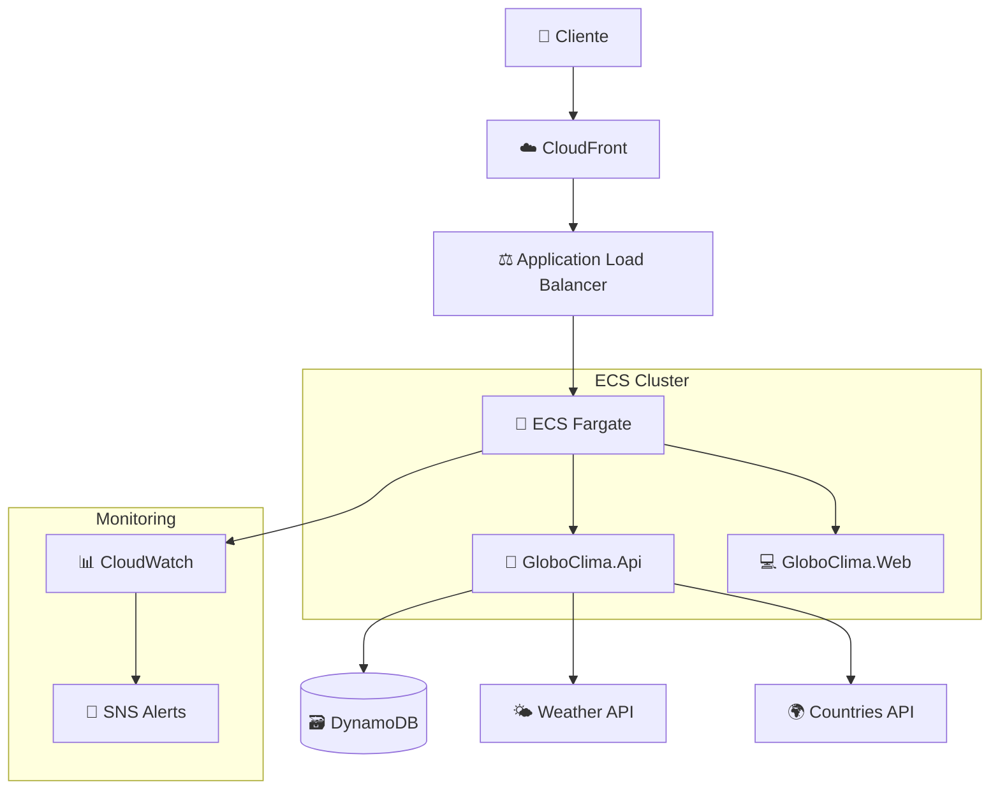
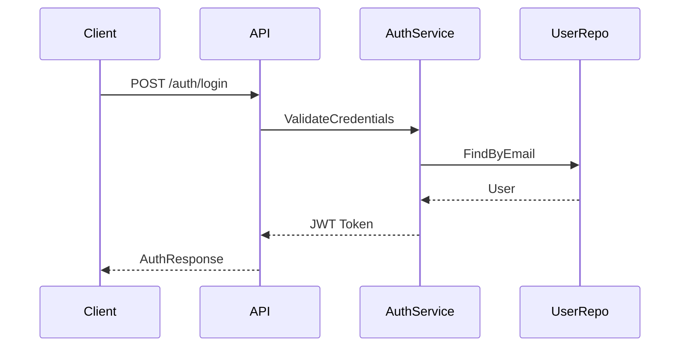
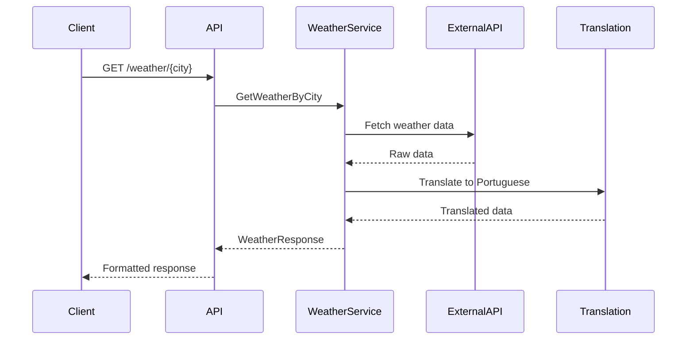
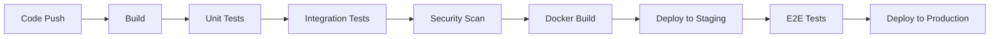

# 🏗️ Arquitetura do Sistema

## 📋 Visão Geral

O GloboClima foi desenvolvido seguindo os princípios da **Clean Architecture**, garantindo separação clara de responsabilidades, testabilidade e manutenibilidade.

## 🎯 Princípios Arquiteturais

### **1. Clean Architecture**
- **Separação por camadas** com dependências unidirecionais
- **Inversão de dependência** através de interfaces
- **Testabilidade** com mocks e repositórios in-memory
- **Flexibilidade** para mudanças de tecnologia

### **2. Domain-Driven Design (DDD)**
- **Entidades de negócio** bem definidas
- **Casos de uso** expressivos
- **Linguagem ubíqua** no código

## 🏛️ Estrutura das Camadas

```
┌─────────────────────────────────────────┐
│             🎨 Presentation             │
│         (Controllers, Views)           │
├─────────────────────────────────────────┤
│           📋 Application               │
│        (Use Cases, DTOs)               │
├─────────────────────────────────────────┤
│             🏛️ Domain                   │
│       (Entities, Interfaces)           │
├─────────────────────────────────────────┤
│         🔌 Infrastructure              │
│    (Repositories, External APIs)       │
└─────────────────────────────────────────┘
```

### **🎨 Presentation Layer**
- **API Controllers** (REST endpoints)
- **Blazor Components** (UI)
- **DTOs** para comunicação externa

### **📋 Application Layer**
- **Use Cases** (lógica de aplicação)
- **Interfaces** para serviços externos
- **DTOs** para transferência de dados

### **🏛️ Domain Layer**
- **Entities** (User, WeatherFavorite, CountryFavorite)
- **Domain Interfaces** (repositórios, serviços)
- **Business Logic** pura

### **🔌 Infrastructure Layer**
- **Repository Implementations** (DynamoDB, In-Memory)
- **External API Services** (Weather, Countries)
- **Authentication** (JWT)

## 🌐 Arquitetura de Deployment

### **AWS Serverless Architecture**



### **Componentes AWS**

| Componente | Função | Configuração |
|------------|--------|--------------|
| **ECS Fargate** | Container orchestration | Auto-scaling 2-10 instâncias |
| **Application Load Balancer** | Load balancing | Health checks, SSL termination |
| **DynamoDB** | NoSQL database | On-demand billing |
| **CloudWatch** | Monitoring | Logs, metrics, alarms |
| **SNS** | Notifications | Email alerts |
| **ECR** | Container registry | Docker images |

## 🔄 Fluxo de Dados

### **1. Autenticação**


### **2. Consulta de Clima**


## 🎨 Padrões de Design

### **1. Repository Pattern**
- **Abstração** do acesso a dados
- **Testabilidade** com implementações in-memory
- **Flexibilidade** para múltiplos providers

```csharp
public interface IUserRepository
{
    Task<User?> GetByIdAsync(Guid id);
    Task<User?> GetByEmailAsync(string email);
    Task<User> CreateAsync(User user);
}
```

### **2. Dependency Injection**
- **Inversão de controle** via DI container
- **Configuração** baseada em ambiente
- **Lifecycle management** automático

### **3. Factory Pattern**
- **Criação** de services baseada em ambiente
- **Configuração** dinâmica de providers

## 🧪 Estratégia de Testes

### **Pirâmide de Testes**

```
      🔺 E2E Tests
     /              \
    /   Integration   \
   /      Tests        \
  /____________________\
       Unit Tests
```

### **Tipos de Teste**

| Tipo | Escopo | Tecnologia | Cobertura |
|------|--------|------------|-----------|
| **Unit** | Domain + Application | xUnit + Moq | 90%+ |
| **Integration** | Controllers + API | WebApplicationFactory | 70%+ |
| **E2E** | Full system | Playwright | Críticos |

### **Estratégias de Mock**

```csharp
// Repositórios
Mock<IUserRepository> userRepoMock;

// Serviços externos
Mock<IWeatherService> weatherServiceMock;

// Web Application Factory para integração
CustomWebApplicationFactory<Program>
```

## 🔐 Segurança

### **1. Autenticação & Autorização**
- **JWT Bearer Tokens** com expiração
- **Hash seguro** de senhas (BCrypt)
- **Validação** de tokens em middleware

### **2. Proteção de APIs**
- **Rate limiting** no ALB
- **Input validation** com Data Annotations
- **CORS** configurado adequadamente

### **3. Secrets Management**
- **Environment variables** para configurações
- **AWS Systems Manager** para secrets
- **Sem hardcoding** de credenciais

## 📊 Observabilidade

### **1. Logging**
```csharp
// Structured logging
logger.LogInformation("User {UserId} logged in from {IP}", 
    userId, request.RemoteIpAddress);
```

### **2. Métricas**
- **Application metrics** (requests, errors)
- **Infrastructure metrics** (CPU, memory)
- **Business metrics** (user registrations, API calls)

### **3. Tracing**
- **Request correlation IDs**
- **Performance tracking**
- **Error tracking**

## 🚀 Performance

### **1. Caching Strategy**
- **In-memory caching** para dados estáticos
- **Response caching** para APIs externas
- **CDN** para assets estáticos

### **2. Database Optimization**
- **DynamoDB** com partition keys eficientes
- **Indexes** para queries frequentes
- **Connection pooling**

### **3. Scaling Strategy**
- **Horizontal scaling** com ECS
- **Auto-scaling** baseado em métricas
- **Load balancing** inteligente

## 🔄 CI/CD Pipeline

### **Stages do Pipeline**



### **Quality Gates**
- ✅ **Unit tests** > 80% pass rate
- ✅ **Integration tests** > 70% pass rate
- ✅ **Code coverage** > 50%
- ✅ **Security scan** sem vulnerabilidades críticas
- ✅ **Performance tests** dentro do SLA

## 📈 Monitoramento

### **1. Health Checks**
```csharp
// API health endpoint
app.MapHealthChecks("/health", new HealthCheckOptions
{
    ResponseWriter = UIResponseWriter.WriteHealthCheckUIResponse
});
```

### **2. Custom Metrics**
- **Business metrics** específicos
- **Performance counters**
- **Error rates** por endpoint

### **3. Alerting**
- **CloudWatch Alarms** para métricas críticas
- **SNS notifications** para a equipe
- **PagerDuty** para emergências

## 🔮 Evolução Arquitetural

### **Próximos Passos**
1. **Event Sourcing** para auditoria
2. **CQRS** para otimização de queries
3. **Microservices** para escalabilidade
4. **GraphQL** para flexibilidade de APIs
5. **Kubernetes** para orquestração avançada

### **Considerações de Scalabilidade**
- **Database sharding** quando necessário
- **Read replicas** para queries frequentes
- **Event-driven architecture** para desacoplamento
- **API Gateway** para roteamento inteligente